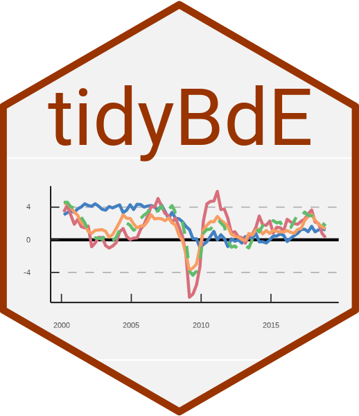
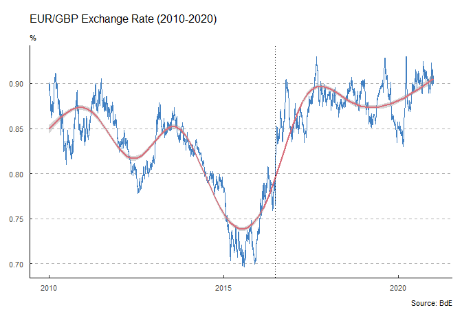
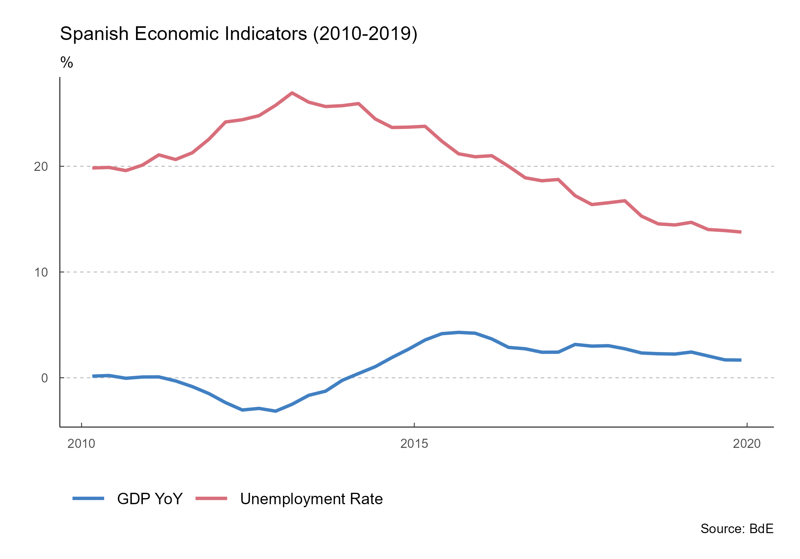

<!-- README.md is generated from README.Rmd. Please edit that file -->

# tidyBdE 

<!-- badges: start -->

[](https://github.com/rOpenSpain/tidyBdE/actions/workflows/check-full.yaml)

[](https://codecov.io/gh/ropenspain/tidyBdE)

<!-- badges: end -->

**tidyBdE** is a API package that helps to retrieve data from [Banco de
España](https://www.bde.es/webbde/en/estadis/infoest/descarga_series_temporales.html).
The data is provided as [tibble](https://tibble.tidyverse.org/) and the
package tries to guess the format of every time-series (dates,
characters and numbers)

## Installation

You can install the developing version of **tidyBdE** with:

``` r
library(remotes)
install_github("ropenspain/tidyBdE")
```

## Examples

Banco de España (**BdE**) provides several time-series, either produced
by the institution itself or compiled for another sources, as
[Eurostat](https://ec.europa.eu/eurostat) or [INE](https://www.ine.es/).

The basic entry point for searching time-series are the catalogs,
(*indexes*) of information:

``` r
library(tidyBdE)

# Search GBP on "TC" (exchange rate) catalog
XR_GBP <- bde_catalog_search("GBP", catalog = "TC")

XR_GBP[c(2, 5)]
#> # A tibble: 1 x 2
#>   Numero_secuencial Descripcion_de_la_serie                                     
#>               <dbl> <chr>                                                       
#> 1            573214 Tipo de cambio. Libras esterlinas por euro (GBP/EUR).Datos ~
```

Now, we can load the series for the GBP/EUR exchange rate using the
sequential number reference (`Numero_Secuencial`) as:

``` r
# Load tidyverse for better handling
library(tidyverse)
#> -- Attaching packages --------------------------------------- tidyverse 1.3.0 --
#> v ggplot2 3.3.3     v purrr   0.3.4
#> v tibble  3.1.0     v dplyr   1.0.5
#> v tidyr   1.1.3     v stringr 1.4.0
#> v readr   1.4.0     v forcats 0.5.1
#> -- Conflicts ------------------------------------------ tidyverse_conflicts() --
#> x dplyr::filter() masks stats::filter()
#> x dplyr::lag()    masks stats::lag()

time_series <- bde_series_load(573214, series_label = "EUR_GBP_XR") %>%
  filter(Date >= "2010-01-01" & Date <= "2020-12-31") %>%
  drop_na()
```

The package also provides a custom `ggplot2` theme based on the
publications of BdE:

``` r

ggplot(time_series, aes(x = Date, y = EUR_GBP_XR)) +
  geom_line(colour = bde_vivid_pal()(1)) +
  geom_smooth(method = "gam", colour = bde_vivid_pal()(2)[2]) +
  labs(
    title = "EUR/GBP Exchange Rate (2010-2020)",
    subtitle = "%",
    caption = "Source: BdE"
  ) +
  geom_vline(
    xintercept = as.Date("2016-06-23"),
    linetype = "dotted"
  ) +
  theme_bde()
#> `geom_smooth()` using formula 'y ~ s(x, bs = "cs")'
```



The package provides also several “shortcut” functions for a selection
of the most relevant macroeconomic series, so there is no need to look
for them in advance:

``` r
gdp <- bde_ind_gdp_var("values")
gdp$label <- "GDP YoY"

UnempRate <- bde_ind_unemployment_rate("values")
UnempRate$label <- "Unemployment Rate"

plotseries <- bind_rows(gdp, UnempRate) %>%
  drop_na() %>%
  filter(Date >= "2010-01-01" & Date <= "2019-12-31")

ggplot(plotseries, aes(x = Date, y = values)) +
  geom_line(aes(color = label)) +
  labs(
    title = "Spanish Economic Indicators (2010-2019)",
    subtitle = "%",
    caption = "Source: BdE"
  ) +
  theme_bde() +
  bde_scale_color_vivid()
```



### A note on caching

You can use **tidyBdE** to create your own local repository at a given
local directory passing the following option:

``` r
options(bde_cache_dir = "./path/to/location")
```

When this option is set, **tidyBdE** would look for the cached file and
it will load it, speeding up the process.

It is possible to update the data (i.e. after every monthly or quaterly
data release) with the following command:

``` r
bde_catalog_update()

# On specific series use the option update_cache = TRUE

bde_series_load("SOME ID", update_cache = TRUE)
```

## Another R packages for downloading Spanish open data

Other useful packages that provides access to Spanish open data:

-   [**opendataes**](https://ropenspain.github.io/opendataes/): A
    package that downloads data from the <https://datos.gob.es> API.
-   [**MicroDatosEs**](https://github.com/rOpenSpain/MicroDatosEs): A
    package that process microdata provided by Spanish statistical
    agencies (mostly, INE).
-   [**CatastRo**](https://github.com/rOpenSpain/CatastRo): A package
    that queries to query Sede electrónica del Catastro API.

## Disclaimer

This package is in no way sponsored endorsed or administered by Banco de
España.
