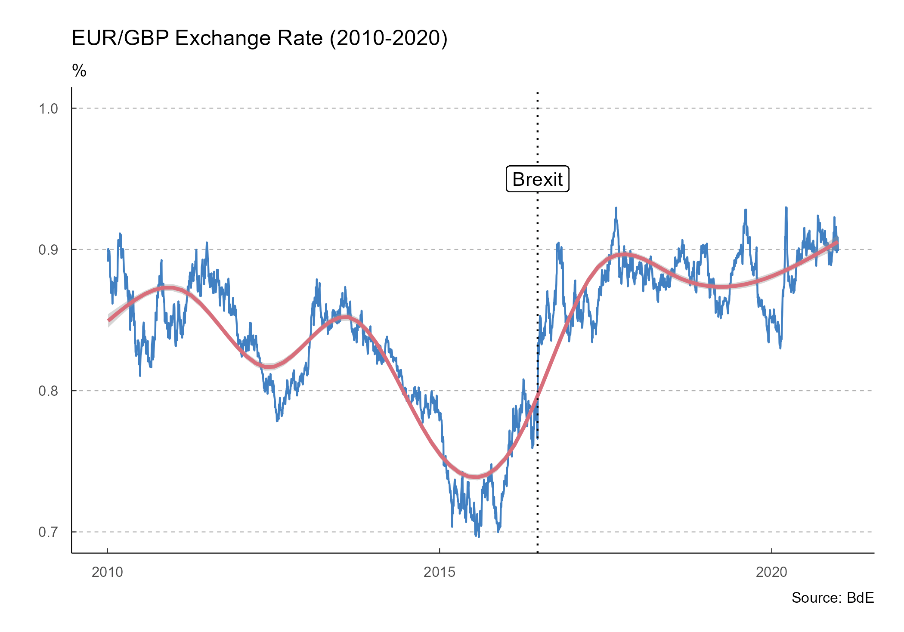
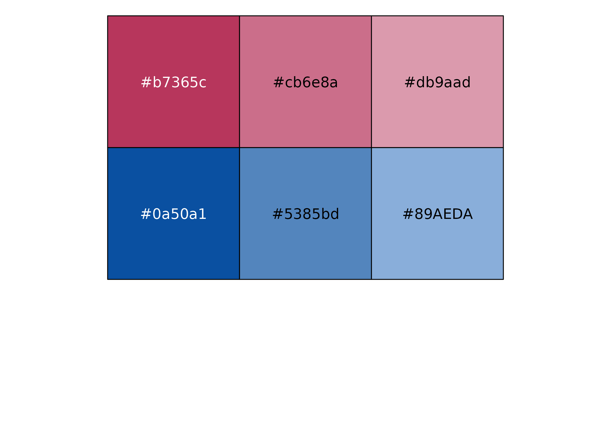

<!-- README.md is generated from README.Rmd. Please edit that file -->

# tidyBdE 

<!-- badges: start -->

[](https://ropenspain.es/)
[](https://CRAN.R-project.org/package=tidyBdE)
[](https://cran.r-project.org/web/checks/check_results_tidyBdE.html)
[](https://cran.r-project.org/package=tidyBdE)
[](https://cran.r-project.org/web/checks/check_results_tidyBdE.html)
[](https://ropenspain.r-universe.dev/)
[](https://github.com/rOpenSpain/tidyBdE/actions/workflows/check-full.yaml)
[](https://app.codecov.io/gh/ropenspain/tidyBdE)
[](https://doi.org/10.5281/zenodo.4673496)
[](https://www.repostatus.org/#active)

<!-- badges: end -->

**tidyBdE** is an API package that helps to retrieve data from [Banco de
España](https://www.bde.es/webbde/en/estadis/infoest/descarga_series_temporales.html).
The data is provided as [tibble](https://tibble.tidyverse.org/) and the
package tries to guess the format of every time-series (dates,
characters and numbers).

## Installation

Install **tidyBdE** from
[**CRAN**](https://CRAN.R-project.org/package=tidyBdE):

``` r
install.packages("tidyBdE")
```

You can install the developing version of **tidyBdE** with:

``` r
library(remotes)

install_github("ropenspain/tidyBdE")
```

Alternatively, you can install the developing version of **tidyBdE**
using the [r-universe](https://ropenspain.r-universe.dev/ui#builds):

``` r

# Enable this universe
options(repos = c(
  ropenspain = "https://ropenspain.r-universe.dev",
  CRAN = "https://cloud.r-project.org"
))

# Install tidyBdE
install.packages("tidyBdE")
```

## Examples

Banco de España (**BdE**) provides several time-series, either produced
by the institution itself or compiled for another sources, as
[Eurostat](https://ec.europa.eu/eurostat) or [INE](https://www.ine.es/).

The basic entry point for searching time-series are the catalogs
(*indexes*) of information. You can search any series by name:

``` r

library(tidyBdE)

# Load tidyverse for better handling
library(tidyverse)


# Search GBP on "TC" (exchange rate) catalog
XR_GBP <- bde_catalog_search("GBP", catalog = "TC")

XR_GBP %>%
  select(Numero_secuencial, Descripcion_de_la_serie) %>%
  # To table on document
  knitr::kable()
```

| Numero\_secuencial | Descripcion\_de\_la\_serie                                         |
| -----------------: | :----------------------------------------------------------------- |
|             573214 | Tipo de cambio. Libras esterlinas por euro (GBP/EUR).Datos diarios |

**Note that BdE files are only provided in Spanish, for the time
being**, the organism is working on the English version. By now, search
terms should be provided in Spanish in order to get search results.

After we have found our series, we can load the series for the GBP/EUR
exchange rate using the sequential number reference
(`Numero_Secuencial`) as:

``` r


seq_number <- XR_GBP %>%
  # First record
  slice(1) %>%
  # Get id
  select(Numero_secuencial) %>%
  # Convert to num
  as.double()

# Load metadata
bde_series_load(seq_number, extract_metadata = TRUE) %>%
  # To table on the vignette
  knitr::kable()
```

| Date                        | 573214                                                             |
| :-------------------------- | :----------------------------------------------------------------- |
| NOMBRE DE LA SERIE          | DTCCBCEGBPEUR.B                                                    |
| NÚMERO SECUENCIAL           | 573214                                                             |
| ALIAS DE LA SERIE           | TC\_1\_1.4                                                         |
| DESCRIPCIÓN DE LA SERIE     | Tipo de cambio. Libras esterlinas por euro (GBP/EUR).Datos diarios |
| DESCRIPCIÓN DE LAS UNIDADES | Libras esterlinas por Euro                                         |
| FRECUENCIA                  | LABORABLE                                                          |

``` r

# Extract series
time_series <- bde_series_load(seq_number, series_label = "EUR_GBP_XR") %>%
  filter(Date >= "2010-01-01" & Date <= "2020-12-31") %>%
  drop_na()
```

### Plots

The package also provides a custom `ggplot2` theme based on the
publications of BdE:

``` r

ggplot(time_series, aes(x = Date, y = EUR_GBP_XR)) +
  geom_line(colour = bde_vivid_pal()(1)) +
  geom_smooth(method = "gam", colour = bde_vivid_pal()(2)[2]) +
  labs(
    title = "EUR/GBP Exchange Rate (2010-2020)",
    subtitle = "%",
    caption = "Source: BdE"
  ) +
  geom_vline(
    xintercept = as.Date("2016-06-23"),
    linetype = "dotted"
  ) +
  geom_label(aes(
    x = as.Date("2016-06-23"),
    y = .95,
    label = "Brexit"
  )) +
  coord_cartesian(ylim = c(0.7, 1)) +
  theme_bde()
#> `geom_smooth()` using formula 'y ~ s(x, bs = "cs")'
```



The package provides also several “shortcut” functions for a selection
of the most relevant macroeconomic series, so there is no need to look
for them in advance:

``` r

gdp <- bde_ind_gdp_var("values")
gdp$label <- "GDP YoY"

UnempRate <- bde_ind_unemployment_rate("values")
UnempRate$label <- "Unemployment Rate"

plotseries <- bind_rows(gdp, UnempRate) %>%
  drop_na() %>%
  filter(Date >= "2010-01-01" & Date <= "2019-12-31")

ggplot(plotseries, aes(x = Date, y = values)) +
  geom_line(aes(color = label)) +
  labs(
    title = "Spanish Economic Indicators (2010-2019)",
    subtitle = "%",
    caption = "Source: BdE"
  ) +
  theme_bde() +
  scale_color_bde_d(palette = "bde_vivid_pal") # Custom palette on the package
```


### Palettes

Two custom palettes, based on the used by BdE on some publications are
available.

``` r


scales::show_col(bde_rose_pal()(6))
```



``` r

scales::show_col(bde_vivid_pal()(6))
```


Those palettes can be applied to a `ggplot2` using some custom utils
included on the package (see `help("scale_color_bde_d", package =
"tidyBdE")`).

``` r
# Load GDP Series

GDP <- bde_series_load(
  series_code = c(
    3777251,
    3777265,
    3777259,
    3777269,
    3777060
  ),
  series_label = c(
    "Agriculture",
    "Industry",
    "Construction",
    "Services",
    "Total"
  )
)


# Manipulate data - tidyverse style

GDP_all <- GDP %>%
  # Filter dates
  filter(Date <= "2020-12-31") %>%
  # Create 'Other' column and convert Date to year
  mutate(
    Other = Total - rowSums(across(Agriculture:Services)),
    Date = as.numeric(format(Date, format = "%Y"))
  ) %>%
  # Sum by year
  group_by(Date) %>%
  summarise_at(vars(-group_cols()), sum) %>%
  # Create percentage
  relocate(Total, .after = Other) %>%
  mutate(across(Agriculture:Other, ~ .x * 100 / Total)) %>%
  # Move cols to rows for plotting
  select(-Total) %>%
  pivot_longer(Agriculture:Other,
    names_to = "serie",
    values_to = "value"
  )


ggplot(data = GDP_all, aes(
  x = Date,
  y = value,
  fill = serie
)) +
  geom_bar(
    position = "stack",
    stat = "identity",
    alpha = 0.8
  ) +
  scale_fill_bde_d(palette = "bde_rose_pal") + # Custom palette on the package
  scale_x_continuous(expand = c(0, 0)) +
  scale_y_continuous(expand = c(0, 0)) +
  theme_bde() +
  labs(
    title = "Spain: Gross domestic product by industry",
    subtitle = "%",
    caption = "Source: BdE"
  )
```


### A note on caching

You can use **tidyBdE** to create your own local repository at a given
local directory passing the following option:

``` r
options(bde_cache_dir = "./path/to/location")
```

When this option is set, **tidyBdE** would look for the cached file on
the `bde_cache_dir` directory and it will load it, speeding up the
process.

It is possible to update the data (i.e. after every monthly or quarterly
data release) with the following commands:

``` r
bde_catalog_update()

# On most of the functions using the option update_cache = TRUE

bde_series_load("SOME ID", update_cache = TRUE)
```

## Another R packages for downloading Spanish open data

Other useful packages that provides access to Spanish open data:

  - [**MicroDatosEs**](https://github.com/rOpenSpain/MicroDatosEs): A
    package that process microdata provided by Spanish statistical
    agencies (mostly, INE).
  - [**CatastRo**](https://github.com/rOpenSpain/CatastRo): A package
    that queries Sede electrónica del Catastro API.
  - [**mapSpain**](https://ropenspain.github.io/mapSpain/): For
    downloading geospatial information from Instituto Geográfico
    Nacional (IGN) and creating maps of Spain.

## Disclaimer

This package is in no way sponsored endorsed or administered by Banco de
España.

## Citation

``` r
citation("tidyBdE")
#> 
#> To cite the 'tidyBdE' package in publications use:
#> 
#> H. Herrero D (2021). _tidyBdE: Download Data from Bank of Spain_. doi:
#> 10.5281/zenodo.4673496 (URL: https://doi.org/10.5281/zenodo.4673496), R
#> package version 0.2.1.9000, <URL:
#> https://ropenspain.github.io/tidyBdE/>.
#> 
#> A BibTeX entry for LaTeX users is
#> 
#>   @Manual{,
#>     title = {tidyBdE: Download Data from Bank of Spain},
#>     author = {Diego {H. Herrero}},
#>     year = {2021},
#>     note = {R package version 0.2.1.9000},
#>     url = {https://ropenspain.github.io/tidyBdE/},
#>     doi = {10.5281/zenodo.4673496},
#>   }
```
