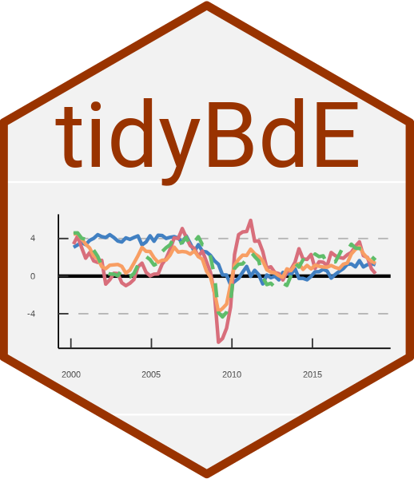

<!-- README.md is generated from README.qmd. Please edit that file -->

# tidyBdE <a href="https://ropenspain.github.io/tidyBdE/"></a>

<!-- badges: start -->

[](https://ropenspain.es/)
[](https://CRAN.R-project.org/package=tidyBdE)
[](https://cran.r-project.org/web/checks/check_results_tidyBdE.html)
[](https://cran.r-project.org/package=tidyBdE)
[](https://cran.r-project.org/web/checks/check_results_tidyBdE.html)
[](https://ropenspain.r-universe.dev/tidyBdE)
[](https://github.com/rOpenSpain/tidyBdE/actions/workflows/check-full.yaml)
[](https://app.codecov.io/gh/ropenspain/tidyBdE)
[](https://www.codefactor.io/repository/github/ropenspain/tidybde)
[](https://doi.org/10.32614/CRAN.package.tidyBdE)
[](https://www.repostatus.org/#active)

<!-- badges: end -->

**tidyBdE** is an **R** package that retrieves time series data from [Banco de
España](https://www.bde.es/webbe/en/estadisticas/recursos/descargas-completas.html)
bulk CSV files and the [Statistics web service
(API)](https://www.bde.es/webbe/en/estadisticas/recursos/api-estadisticas-bde.html).
Data are returned as [**tibble**](https://tibble.tidyverse.org/) objects. The
package infers date, character and numeric fields where possible. Bulk CSV
helpers identify series with the stable sequential number (`Numero_secuencial`),
while API helpers use `Nombre_de_la_serie` as the API series code.

::: callout-important
This package is not sponsored, endorsed or administered by Banco de España.
:::

## Installation

Install **tidyBdE** from [CRAN](https://CRAN.R-project.org/package=tidyBdE):

```{r}
#| eval: false
install.packages("tidyBdE")
```

Install the development version of **tidyBdE** from GitHub with:

```{r}
#| eval: false
pak::pak("ropenspain/tidyBdE")
```

Alternatively, install **tidyBdE** from
[r-universe](https://ropenspain.r-universe.dev/tidyBdE):

```{r}
#| eval: false
# Install tidyBdE in R:
install.packages(
  "tidyBdE",
  repos = c(
    "https://ropenspain.r-universe.dev",
    "https://cloud.r-project.org"
  )
)
```

## Examples

Banco de España (**BdE**) provides several time series, either produced by the
institution or compiled from other sources, such as
[Eurostat](https://ec.europa.eu/eurostat) or [INE](https://www.ine.es/).

The basic entry point for discovering time series is catalog metadata. You can
search for time series by name:

```{r}
#| label: search
#| results: false
library(tidyBdE)

# Load packages for data handling and plotting.
library(ggplot2)
library(dplyr)
library(tidyr)

# Search for GBP in the "TC" (exchange rate) catalog metadata.
xr_gbp <- bde_catalog_search("GBP", catalog = "TC")

xr_gbp |>
  select(Numero_secuencial, Descripcion_de_la_serie) |>
  # Display the table in the document.
  knitr::kable()
```

```{r}
#| echo: false
#| results: asis
xr_gbp |>
  select(Numero_secuencial, Descripcion_de_la_serie) |>
  # Display the table in the document.
  knitr::kable()
cat("<p class=\"caption\">Table 1: Search results</p>")
```

::: callout-note
BdE catalog metadata is currently available in Spanish only, so search terms
must be in Spanish to retrieve results. Banco de España is working on an English
version.
:::

After finding a time series, you can load the GBP/EUR exchange rate from bulk
CSV files using its stable sequential number (`Numero_secuencial`):

```{r}
#| label: find
seq_number <- xr_gbp |>
  # Select the first record.
  slice(1) |>
  # Get the stable sequential number.
  select(Numero_secuencial) |>
  # Convert to numeric.
  as.double()

# Extract the series.
time_series <- bde_series_load(seq_number, series_label = "EUR_GBP_XR") |>
  filter(Date >= "2010-01-01" & Date <= "2020-12-31") |>
  drop_na()

time_series
```

### Plots

The package also provides a custom **ggplot2** theme based on BdE publications:

```{r}
#| label: chart
#| fig-asp: 0.7
#| fig-cap: "EUR/GBP exchange rate (2010-2020)"
ggplot(time_series, aes(x = Date, y = EUR_GBP_XR)) +
  geom_line(colour = bde_tidy_palettes(n = 1)) +
  geom_smooth(method = "gam", colour = bde_tidy_palettes(n = 2)[2]) +
  labs(
    title = "EUR/GBP exchange rate (2010-2020)",
    subtitle = "%",
    caption = "Source: BdE"
  ) +
  geom_vline(
    xintercept = as.Date("2016-06-23"),
    linetype = "dotted"
  ) +
  geom_label(aes(
    x = as.Date("2016-06-23"),
    y = 0.95,
    label = "Brexit"
  )) +
  coord_cartesian(ylim = c(0.7, 1)) +
  theme_tidybde()
```

The package also provides convenience functions for selected Spanish
macroeconomic indicators, so you do not need to search for them manually:

```{r}
#| label: macroseries
#| fig-asp: 0.7
#| fig-cap: "Spanish economic indicators (2010-2019)"
# Data in long format.

plotseries <- bde_ind_gdp_var("GDP YoY", out_format = "long") |>
  bind_rows(
    bde_ind_unemployment_rate("Unemployment Rate", out_format = "long")
  ) |>
  drop_na() |>
  filter(Date >= "2010-01-01" & Date <= "2019-12-31")

ggplot(plotseries, aes(x = Date, y = serie_value)) +
  geom_line(aes(color = serie_name), linewidth = 1) +
  labs(
    title = "Spanish economic indicators (2010-2019)",
    subtitle = "%",
    caption = "Source: BdE"
  ) +
  theme_tidybde() +
  scale_color_bde_d(palette = "bde_vivid_pal") # Use a custom package palette.
```

### Palettes

Three custom palettes are available. They are based on colors used by BdE in
selected publications.

Apply these palettes to **ggplot2** plots with the scale functions provided by
the package. See `help("scale_color_bde_d", package = "tidyBdE")`.

### A note on caching

Create a local cache by setting the following option:

``` r
options(bde_cache_dir = "./path/to/location")
```

When this option is set, **tidyBdE** looks for cached bulk CSV files in the
`bde_cache_dir` directory and loads them to speed up data retrieval.

Update cached data after monthly or quarterly releases with the following
commands:

```{r}
#| eval: false
bde_catalog_update()

# Or use `update_cache = TRUE` in most functions.

bde_series_load(573214, update_cache = TRUE)
```

## Citation

```{r}
#| echo: false
#| results: asis
print(citation("tidyBdE"), style = "html")
```

A BibTeX entry for LaTeX users is:

```{r}
#| echo: false
#| comment: ''
toBibtex(citation("tidyBdE"))
```
