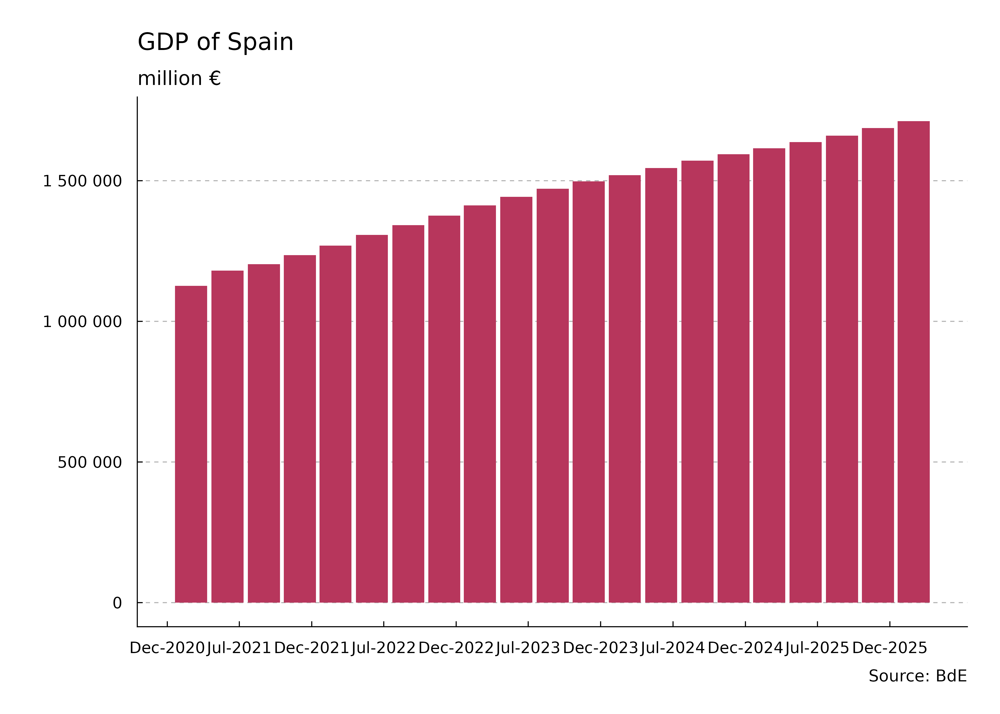
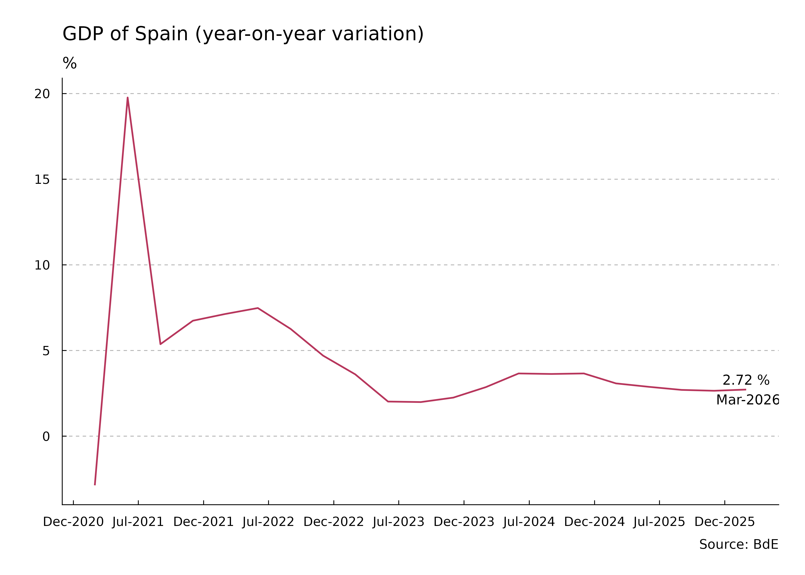
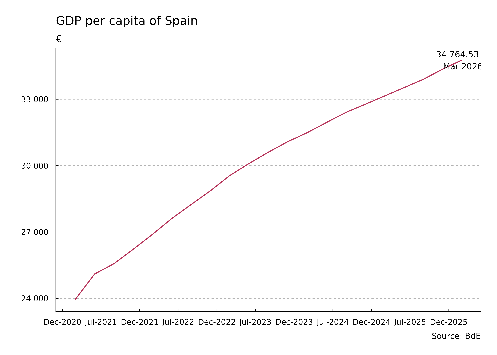
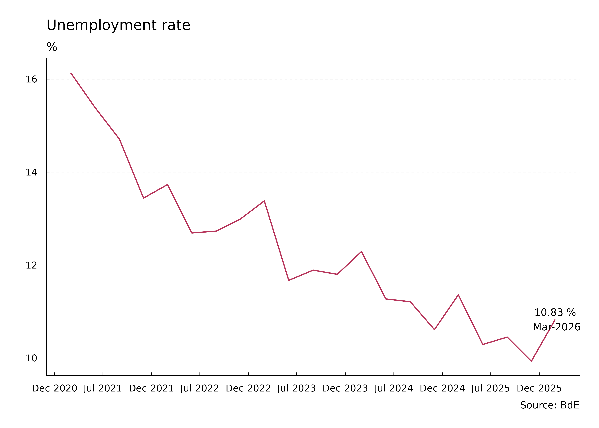
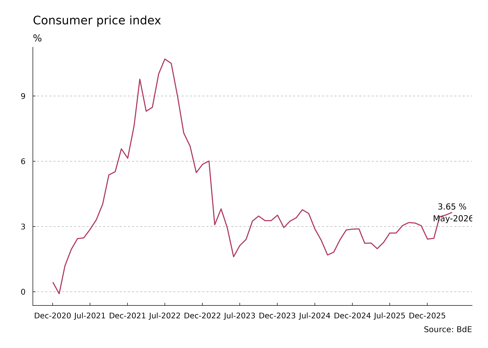
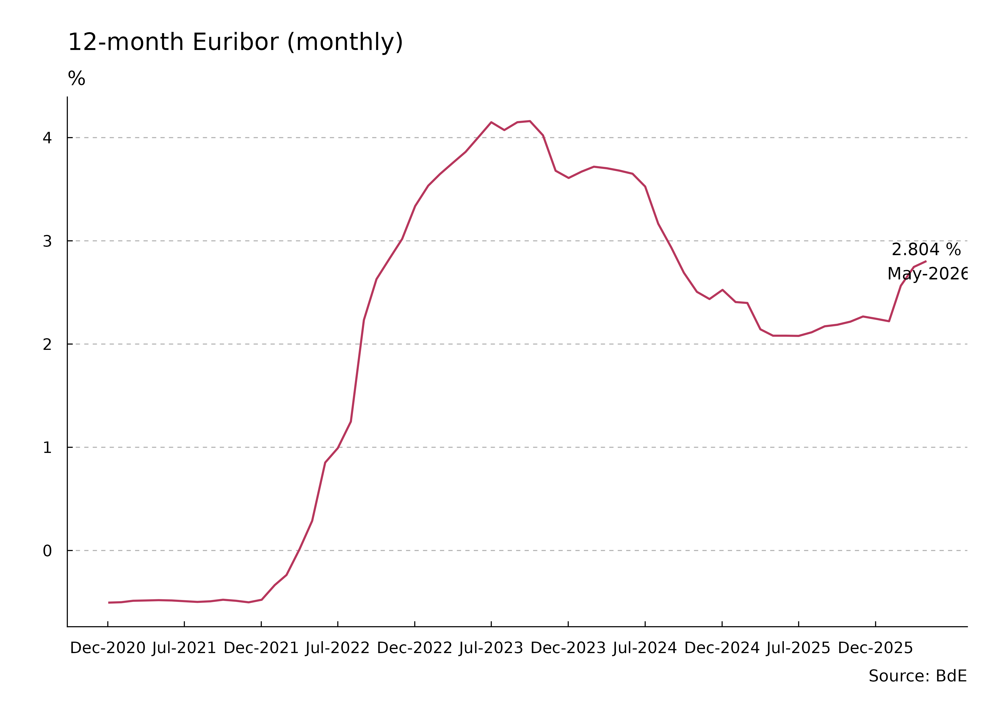
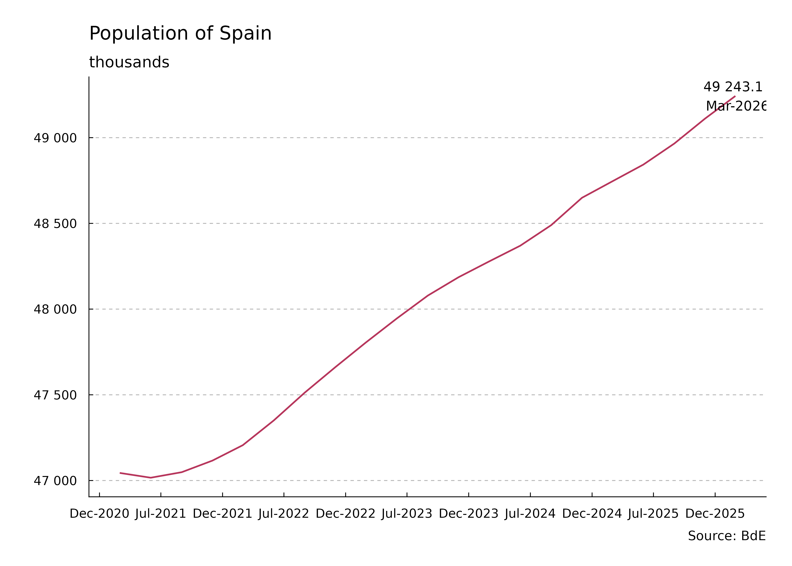

# Main macroeconomic series

This article shows the evolution of selected economic indicators of
Spain, based on information from [Banco de España](https://www.bde.es/).

Last update: **24-February-2026**.

``` r
library(tidyBdE)
library(ggplot2)
library(dplyr)
library(tidyr)

col <- bde_tidy_palettes(1, "bde_rose_pal")
date <- Sys.Date()
ny <- as.numeric(format(date, format = "%Y")) - 6
nd <- as.Date(paste0(ny, "-12-31"))

br <- seq(nd, Sys.Date(), "6 months")
```

## GDP of Spain

### Aggregated (last 4 quarters)



Figure 1: GDP of Spain - Aggregated last 4 quarters

### Year-on-year variation



Figure 2: GDP of Spain - Year-on-year variation

### GDP per capita



Figure 3: GDP per Capita of Spain

## Unemployment Rate



Figure 4: Unemployment rate

## Consumer Price Index



Figure 5: Consumer Price Index

## Monthly Euribor



Figure 6: Monthly Euribor

## Population



Figure 7: Population in thousands
