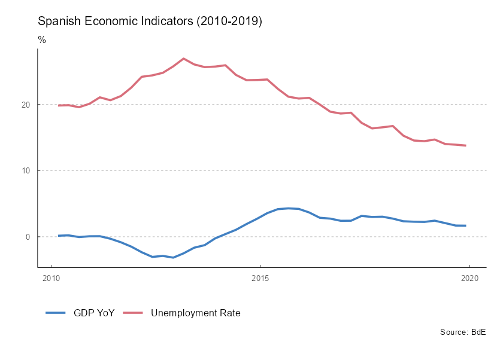

# Get Started with tidyBdE

**tidyBdE** is an API package that helps to retrieve data from [Banco de
España](https://www.bde.es/webbe/en/estadisticas/recursos/descargas-completas.html).
The data is returned as a [`tibble`](https://tibble.tidyverse.org/) and
the package tries to guess the format of every time-series (dates,
characters and numbers).

## Search series

Banco de España (**BdE**) provides several time-series, either produced
by the institution itself or compiled for another sources, as
[Eurostat](https://ec.europa.eu/eurostat) or [INE](https://www.ine.es/).

The basic entry point for searching time-series are the catalogs
(*indexes*) of information. You can search any series by name:

``` r
library(tidyBdE)

library(ggplot2)
library(dplyr)
library(tidyr)


# Search GBP on "TC" (exchange rate) catalog
XR_GBP <- bde_catalog_search("GBP", catalog = "TC")

XR_GBP %>%
  select(Numero_secuencial, Descripcion_de_la_serie) %>%
  # To table on document
  knitr::kable()
```

| Numero_secuencial | Descripcion_de_la_serie                                            |
|------------------:|:-------------------------------------------------------------------|
|            573214 | Tipo de cambio. Libras esterlinas por euro (GBP/EUR).Datos diarios |

**Note that BdE files are only provided in Spanish, for the time
being**, the organism is working on the English version. By now, search
terms should be provided in Spanish in order to get search results.

After we have found our series, we can load the series for the GBP/EUR
exchange rate using the sequential number reference
(`Numero_Secuencial`) as:

``` r
seq_number <- XR_GBP %>%
  # First record
  slice(1) %>%
  # Get id
  select(Numero_secuencial) %>%
  # Convert to num
  as.double()


seq_number
#> [1] 573214


time_series <- bde_series_load(seq_number, series_label = "EUR_GBP_XR") %>%
  filter(Date >= "2010-01-01" & Date <= "2020-12-31") %>%
  drop_na()
```

## Plot series

The package also provides a custom **ggplot2** theme based on the
publications of BdE:

``` r
ggplot(time_series, aes(x = Date, y = EUR_GBP_XR)) +
  geom_line(colour = bde_tidy_palettes(n = 1)) +
  geom_smooth(method = "gam", colour = bde_tidy_palettes(n = 2)[2]) +
  labs(
    title = "EUR/GBP Exchange Rate (2010-2020)",
    subtitle = "%",
    caption = "Source: BdE"
  ) +
  geom_vline(
    xintercept = as.Date("2016-06-23"),
    linetype = "dotted"
  ) +
  geom_label(aes(
    x = as.Date("2016-06-23"),
    y = .95,
    label = "Brexit"
  )) +
  coord_cartesian(ylim = c(0.7, 1)) +
  theme_tidybde()
```


EUR/GBP Exchange Rate (2010-2020)

The package provides also several “shortcut” functions for a selection
of the most relevant macroeconomic series, so there is no need to look
for them in advance:

``` r
# Data in "long" format

plotseries <- bde_ind_gdp_var("GDP YoY", out_format = "long") %>%
  bind_rows(
    bde_ind_unemployment_rate("Unemployment Rate", out_format = "long")
  ) %>%
  drop_na() %>%
  filter(Date >= "2010-01-01" & Date <= "2019-12-31")

ggplot(plotseries, aes(x = Date, y = serie_value)) +
  geom_line(aes(color = serie_name), linewidth = 1) +
  labs(
    title = "Spanish Economic Indicators (2010-2019)",
    subtitle = "%",
    caption = "Source: BdE"
  ) +
  theme_tidybde() +
  scale_color_bde_d(palette = "bde_vivid_pal") # Custom palette on the package
```



Spanish Economic Indicators (2010-2019)

## A note on caching

You can use **tidyBdE** to create your own local repository at a given
local directory passing the following option:

``` r
options(bde_cache_dir = "./path/to/location")
```

When this option is set, **tidyBdE** would look for the cached file on
the `bde_cache_dir` directory and it will load it, speeding up the
process.

It is possible to update the data (i.e. after every monthly or quarterly
data release) with the following commands:

``` r
bde_catalog_update()

# On most of the functions using the option update_cache = TRUE

bde_series_load("SOME ID", update_cache = TRUE)
```
