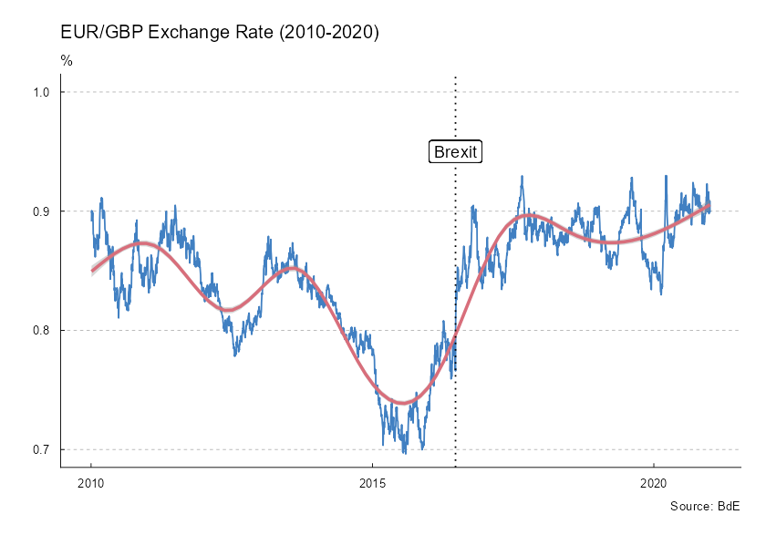
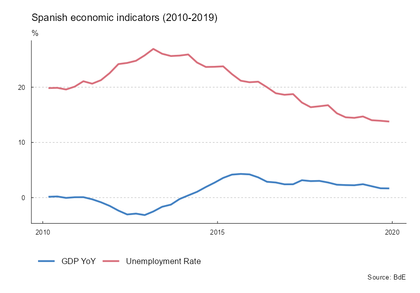

<!-- tidyBdE.qmd is generated from tidyBdE.qmd.orig. Please edit that file -->


**tidyBdE** is an **R** package that retrieves time series data from [Banco de
España](https://www.bde.es/webbe/en/estadisticas/recursos/descargas-completas.html)
bulk CSV files and the [Statistics web service
(API)](https://www.bde.es/webbe/en/estadisticas/recursos/api-estadisticas-bde.html).
Data are returned as [**tibble**](https://tibble.tidyverse.org/) objects. The
package infers date, character and numeric column types where possible. Bulk CSV
helpers identify series with stable sequential numbers (`Numero_secuencial`),
while API helpers use `Nombre_de_la_serie` as the API series code.

## Search for time series

Banco de España (**BdE**) publishes numerous time series produced by the
institution or compiled from other sources, such as
[Eurostat](https://ec.europa.eu/eurostat) or [INE](https://www.ine.es/).

The basic entry point for discovering time series is catalog metadata. You can
search for time series by name:


``` r
library(tidyBdE)

library(ggplot2)
library(dplyr)
library(tidyr)

# Search for GBP in the "TC" (exchange rate) catalog metadata.
xr_gbp <- bde_catalog_search("GBP", catalog = "TC")

xr_gbp |>
  select(Numero_secuencial, Descripcion_de_la_serie) |>
  # Display the table in the document.
  knitr::kable()
```

::: {#tbl-search}


| Numero_secuencial|Descripcion_de_la_serie                                            |
|-----------------:|:------------------------------------------------------------------|
|            573214|Tipo de cambio. Libras esterlinas por euro (GBP/EUR).Datos diarios |


Search results
:::

**Note:** BdE catalog metadata is currently available in Spanish only, so search
terms must be in Spanish to retrieve results. Banco de España is working on an
English version.

After finding a time series, load the GBP/EUR exchange rate from bulk CSV files
using its stable sequential number (`Numero_secuencial`):


``` r
seq_number <- xr_gbp |>
  # Select the first record.
  slice(1) |>
  # Get the stable sequential number.
  pull(Numero_secuencial) |>
  # Convert to numeric.
  as.double()

seq_number
#> [1] 573214

time_series <- bde_series_load(seq_number, series_label = "EUR_GBP_XR") |>
  filter(Date >= "2010-01-01" & Date <= "2020-12-31") |>
  drop_na()

time_series
#> # A tibble: 2,816 × 2
#>    Date       EUR_GBP_XR
#>    <date>          <dbl>
#>  1 2010-01-04      0.891
#>  2 2010-01-05      0.900
#>  3 2010-01-06      0.899
#>  4 2010-01-07      0.900
#>  5 2010-01-08      0.893
#>  6 2010-01-11      0.899
#>  7 2010-01-12      0.897
#>  8 2010-01-13      0.895
#>  9 2010-01-14      0.890
#> 10 2010-01-15      0.881
#> # ℹ 2,806 more rows
```

## Plot time series

The package also provides a custom **ggplot2** theme based on BdE publications:


``` r
ggplot(time_series, aes(x = Date, y = EUR_GBP_XR)) +
  geom_line(colour = bde_tidy_palettes(n = 1)) +
  geom_smooth(method = "gam", colour = bde_tidy_palettes(n = 2)[2]) +
  labs(
    title = "EUR/GBP exchange rate (2010-2020)",
    subtitle = "%",
    caption = "Source: BdE"
  ) +
  geom_vline(
    xintercept = as.Date("2016-06-23"),
    linetype = "dotted"
  ) +
  geom_label(aes(
    x = as.Date("2016-06-23"),
    y = 0.95,
    label = "Brexit"
  )) +
  coord_cartesian(ylim = c(0.7, 1)) +
  theme_tidybde()
```

<div class="figure">

<p class="caption">Figure 1: EUR/GBP exchange rate (2010-2020)</p>
</div>

The package also provides convenience functions for selected Spanish
macroeconomic indicators, so you do not need to search for them manually:


``` r
# Data in long format.

plotseries <- bde_ind_gdp_var("GDP YoY", out_format = "long") |>
  bind_rows(
    bde_ind_unemployment_rate("Unemployment Rate", out_format = "long")
  ) |>
  drop_na() |>
  filter(Date >= "2010-01-01" & Date <= "2019-12-31")

ggplot(plotseries, aes(x = Date, y = serie_value)) +
  geom_line(aes(color = serie_name), linewidth = 1) +
  labs(
    title = "Spanish economic indicators (2010-2019)",
    subtitle = "%",
    caption = "Source: BdE"
  ) +
  theme_tidybde() +
  scale_color_bde_d(palette = "bde_vivid_pal") # Use a custom package palette.
```

<div class="figure">

<p class="caption">Figure 2: Spanish economic indicators (2010-2019)</p>
</div>

## A note on caching

Create a local cache by setting the following option:


``` r
options(bde_cache_dir = "./path/to/location")
```

When this option is set, **tidyBdE** looks for cached bulk CSV files in the
`bde_cache_dir` directory and loads them to speed up data retrieval.

Update cached data after monthly or quarterly releases with the following
commands:


``` r
bde_catalog_update()

# Or use `update_cache = TRUE` in most functions.

bde_series_load(573214, update_cache = TRUE)
```


